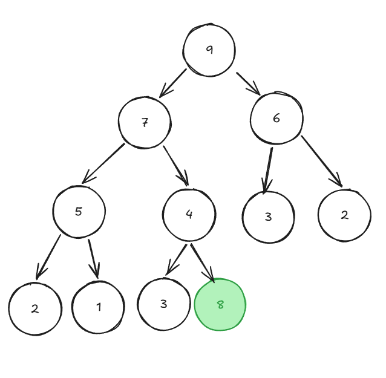
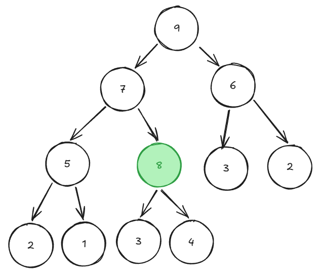
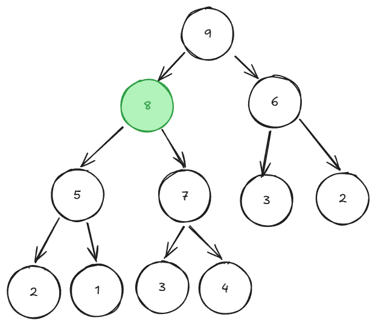
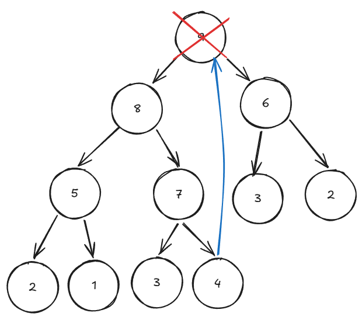
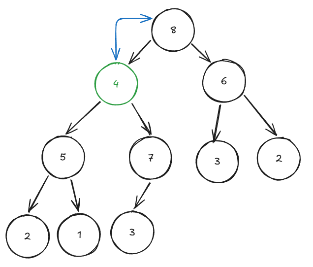
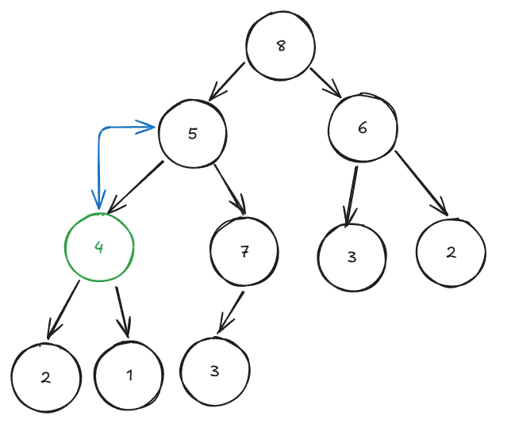

# 완전 이진 트리 - Heap
- Heap은 완전 이진 트리의 일종으로 우선순위 큐를 위해 만들어졌다.
- 여러 개의 값들 중 제일 큰 수나 제일 작은 수를 찾기 위해 만들어진 자료구조이다.
- 힙은 일종의 **느슨한 정렬 상태**를 유지한다. 
  - 느슨한 정렬상태 -> 가중치가 큰 값이 상위 레벨에 있고 낮은 값이 하위에 있는 정도
- 힙 트리에서는 중복된 값을 허용한다.

## 힙의 종류
1. 최대 힙
    - 부모 노드의 값이 자식 노드의 값보다 항상 크거나 같은 경우
2. 최소 힙
    - 부모 노드의 값이 자식 노드의 값보다 항상 작거나 같은 경우

## 힙의 구현


### 힙의 삽입
1. 힙에 새로운 요소가 들어오면 새로운 노드를 힙의 마지막 노드에 이어서 삽입한다. 
2. 새로운 노드를 부모 노드들과 교환해서 완성시킨다.




```c
public void Push(int data)
{
    heap.Add(data); // 1. 일단 맨 뒤에 추가
    int now = heap.Count - 1; // 추가된 데이터의 인덱스

    // 2. Heapify Up: 부모와 비교하며 위로 올라감
    while (now > 0)
    {
        int parent = (now - 1) / 2; // 부모 인덱스 계산

        // 부모보다 내가 더 작으면 Swap
        if (heap[now] < heap[parent])
        {
            int temp = heap[now];
            heap[now] = heap[parent];
            heap[parent] = temp;

            now = parent; // 인덱스를 부모 위치로 갱신
        }
        else
        {
            break; // 부모보다 크면 정지
        }
    }
}
```

### 힙의 삭제
1. 최대 힙에서 최댓값은 루트노드이므로 루트 노드가 삭제된다.
2. 삭제된 루트 노드에는 힙의 마지막 노드를 가져온다.
3. 힙을 재구성한다.




```c
public int Pop()
{
    if (heap.Count == 0) return -1;

    int rootValue = heap[0];
    int lastIndex = heap.Count - 1;
    heap[0] = heap[lastIndex];
    heap.RemoveAt(lastIndex);

    int index = 0;

    while (true)
    {
        int leftChild = (index * 2) + 1;
        int rightChild = (index * 2) + 2;
        int nextTarget = -1;

        if (leftChild < heap.Count)
        {
            nextTarget = leftChild;
        }
        else
        {
            break;
        }

        if (rightChild < heap.Count && heap[rightChild] < heap[leftChild])
        {
            nextTarget = rightChild;
        }

        if (heap[nextTarget] > heap[index])
        {
            int temp = heap[index];
            heap[index] = heap[nextTarget];
            heap[nextTarget] = temp;
        }
        else
        {
            break;
        }
    }

    return rootValue;
}
```