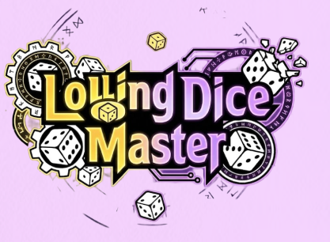

# KGA 1팀 1단 완성해 사전합반 프로젝트(Unity 협업 프로젝트)

## 프로젝트 소개
- 제목 : Lolling : Dice Master
- 소개 : 기존의 로그라이크 장르에 운적인 요소가 비중이 크게끔 설계된 
- 장르 : 로그라이크
## 기술 스택

**Unity**

- 절차적 맵 생성 시스템 설계 및 구현
- Animator 상태 머신 설계 및 전이 충돌 해결
- UI HUD 표시와 게임 상태 데이터 연결 구현
- 오브젝트 풀링 기반 씬 관리

**C#**

- 그래프 기반 자료구조 활용 경험
- 상태 분리 기반 로직 구성 및 흐름 제어
- 싱글톤 매니저 패턴 설계 및 구현

**협업**

- Git을 이용한 기능 단위 작업 및 병합 경험
- 기획팀과의 협업 경험 (기획 8인 / 개발 5인)