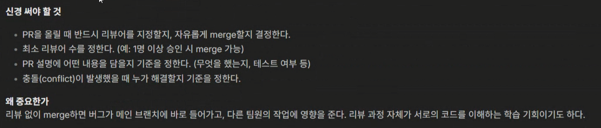
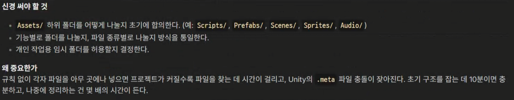
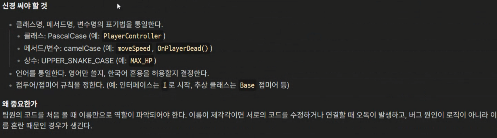
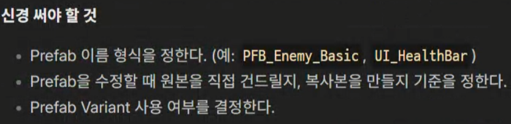
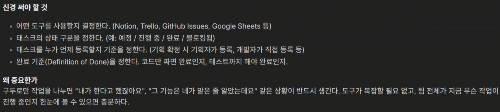
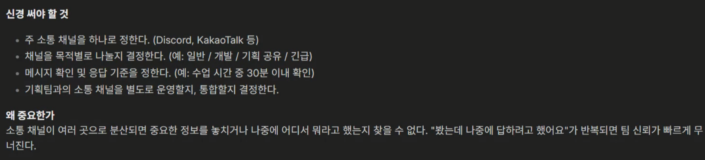
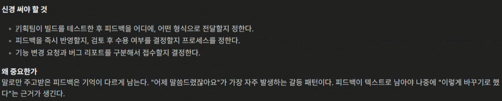

# 최대공약수와 최소공배수
```c
using System;

public class Solution
{
    public int[] solution(int n, int m)
    {
        int[] answer = new int[2]; // 한정된 크기니 미리 크기 선언

        // 어떤 값이 큰값인지 알아내기 위함
        int max = Math.Max(n, m);
        int min = Math.Min(n, m);

        // 공약수는 나머지가 0이라는 것이기 때문에 나머지가 0이라면 그 때 종료
        while(min != 0)
        {
            int temp = max % min;
            max = min;
            min = temp;
        }

        int answer1 = max;
        int answer2 = (n * m) / max;

        answer[0] = answer1;
        answer[1] = answer2;

        return answer;
    }
}
```

# 3진법 뒤집기
```c
using System;
using System.Linq;
public class Solution
{
    public int solution(int n)
    {
        string str = "";

        // 3진법으로 만들어주기 위해 3으로 계속 나눠줌 원래 3진법의 역으로 정렬됨
        while (n > 0)
        {
            str += (n % 3).ToString();
            n /= 3;
        }

        int  count = 1;
        int answer = 0;

        // 카운트를 늘려주면서 자릿수마다 3의 제곱을 해줌
        for (int i = str.Length - 1; i >= 0; i--)
        {
            int currentDigit = str[i] - '0';
            answer += currentDigit * count;

            count *= 3;
        }

        return answer;
    }
}
```

# 예산
```c
using System;

public class Solution
{
    public int solution(int[] d, int budget)
    {
        int answer = 0;

        // 작은 것부터 처리해주면 제일 많은 지원을 할 수 있음 -> 작은 거부터 정렬
        Array.Sort(d);

        for(int i=0;i<d.Length;i++>)
        {
            if (budget >= d[i])
            {
                budget -= d[i];
                answer++;
            }
            else
                break;
        }

        return answer;
    }
}
```

조진행 : 나이대 있음 코딩 처음함.. : 애니메이션, UI, 플레이어캐릭터
김태성 : 코딩 많이 안해봄.  : 카메라, 레벨 디자인 에셋
이승열 : 게임 쪽 아니지만 전공을했었음. : 게임 매니저 등등

add people : write

개발팀 컨벤션 목록
1. 브랜치 전략
   - main을 항상 실행 가능한 상태로 유지할지, 아니면 develop 브랜치를 따로 둘지
   - 기능 브랜치 인원단위
   - 브랜치 이름 형식을 정한다.

2. 커밋 메시지 규칙
   - 커밋 메시지 언어 통일
   - 접두어 사용 결졍 ( feat fix docs refactor )

3. PR 및 Merge 규칙


1. Unity 프로젝트 폴더 구조


1. 네이밍 규칙


1. 씬 관리 방식

2. 프리팹 관리 방식


1. 작업 관리 도구 및 태스크 기록 방식


1. 커뮤니케이션 채널 및 응답 기준


10. 기획-개발 간 피드백 전달 방식


11.

Readme 작성