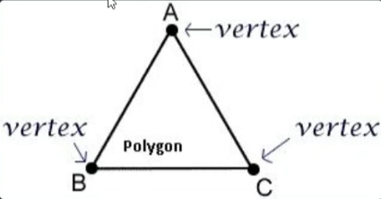
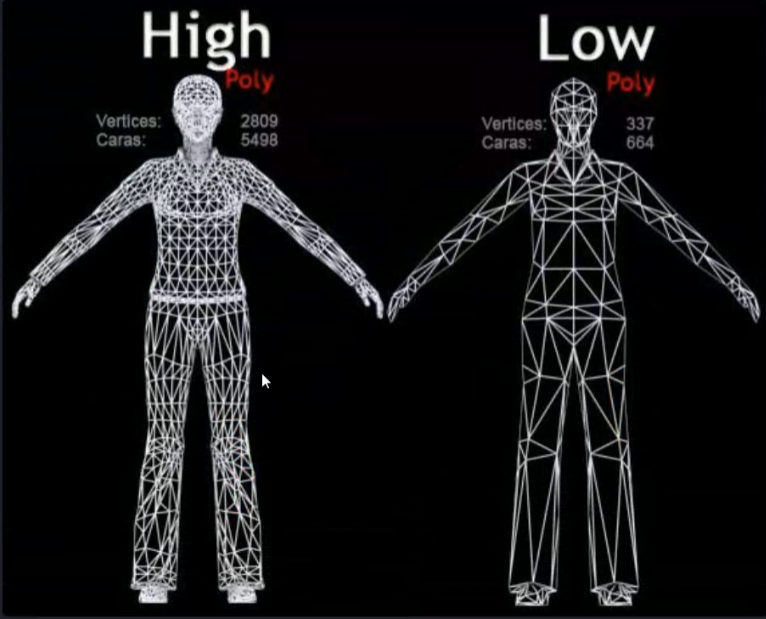
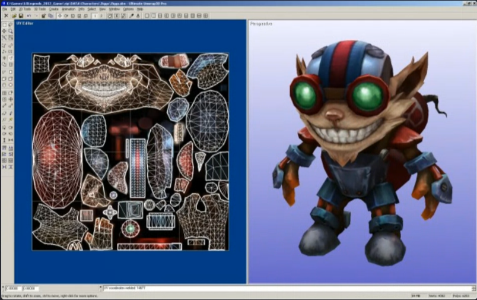
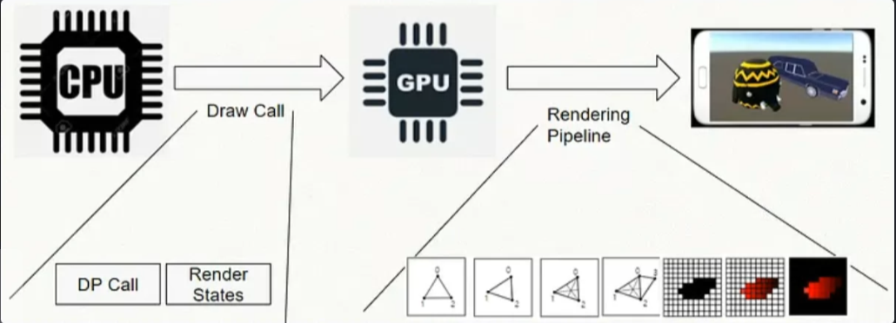

1) 정리
```
CPU : 이 3D 모델들을 이 카메라 시점에서 그려줘(명령, 데이터 전달)
GPU : 알겠어. 
1. 3D를 2D로 변환(Vertex)하고 
2. 픽셀로 쪼개서(Rasterization), 
3. 색을 채워서 (Pixel/Fragment))화면에 보여줄게
```

## 2) GPU관점에서 RP를 처리하는 최소 단위

### 2-1) Vertex(점)

- 3D 공간상의 **한 점**을 의미합니다. 좌표(x,y,z)로 구성.
### Polygon(면, 다각형)
- Vertex(점)들이 모여 만들어지는 **최소의 면 단위**.
### Mesh(모델)

- **메시(Mesh)** : 면(Polygon)들의 집합 = 모델
```
-> GPU가 하는일

점(Vertex) -> 면(Polygon) -> 메시(Model)

GPU가 점의 위취를 우선적으로 계산, 

그 점들을 이어서 Polygon이라는 면을 만들어서 모델을 이루고,

최종적으로 Pixel에 색을 채워 넣는다.
```

- **Mesh Filter**   : 어떤 모양(Mesh)을 쓸 것인가?
- **Mesh Renderer** : 그 모양을 화면에 '그리는' 담당자.(Material 참조)
- **Material**      : 어떤 색과 질감을 그릴건데?

# 3. 게임 그래픽을 구성하는 핵심 요소

```
Texture, Material, Shader
```

## 3-1. Texture
+ UV Mapping



### 3-1-1. UV Mapping
- 3D 표면의 위치(점/면)와 2D 텍스처의 위치를 연결하는 과정.
  2D 이미지를 3D 물체 표면에 정확히 붙이는 방법이다.

### 3-1-2. Auto Mapping Tools
- blender, 마야 등등

## 3-2 Material

- 게임 화면에 보이는 질감을 담당합니다.
- 색상, 질감, 빛, 투명도 등 정보를 포함합니다.

## 3-3. Shader
- Material이 가진 Texture 혹은 색상 정보를 조합해서 화면에 최종적으로 질감을 입히는 역활!
- Shader(틀/설계도) : 어떤 데이털르 담을 **빈 칸 (속성)**을 가집니다.
  

# 4. 그래픽 처리 순서(게임 엔진)

## 4가지(거시적)
1. CPU 명령(Draw-Call)
   - CPU가 무엇을 그릴지 정해서 명령을 내리면, 
2. Vertex Shader
    - GPU가 그 물체의 점(Vertex)을 화면 위치에 맞게 옮김.
3. Rasterizer
    - 모니터 눈금에 맞춰 픽셀로 쪼갬.
4. Pixel/Fragment Shader
    - 마지막으로 그 칸들에 색을 채운다.
## 8가지(미시적)